# Instant-FLIM-Analysis
An open-source Matlab program that analyzes the [instant FLIM](https://www.biorxiv.org/content/10.1101/2020.02.05.936039v2) imaging data.

```latex
@article {InstantFLIM2020,
	author = {Zhang, Yide and Guldner, Ian H. and Nichols, Evan L. and Benirschke, David and Smith, Cody J. and Zhang, Siyuan and Howard, Scott S.},
	title = {High-speed, long-term, 4D in vivo lifetime imaging in intact and injured zebrafish and mouse brains by instant FLIM},
	year = {2020},
	doi = {10.1101/2020.02.05.936039},
	URL = {https://www.biorxiv.org/content/10.1101/2020.02.05.936039v2},
	journal = {bioRxiv}
}
```

## 1. Introduction

Instant-FLIM-Analysis is an open-source Matlab program with graphical
user interfaces (GUIs) that allows users to analyze the imaging data
acquired with an instant FLIM system. Specifically, only the
"Intensity", "G", and "S" images from the instant FLIM experiments are
required; all other FLIM data, such as fluorescence lifetime images,
phasor plots, and image segments based on regions of interest (ROIs) or
K-means clustering, can be generated by the program. The program is easy
to use for its user-friendly GUIs. Meanwhile, as the program is fully
open-source and highly modularized, users with Matlab programming
expertise can easily modify the code to customize existing functions or
to add new functions.

## 2. Installation

### Option 1

-   *This option requires a Matlab license*

-   Install Matlab on your computer

-   Download or clone (git clone) this GitHub repository:

    https://github.com/yzhang34/Instant-FLIM-Analysis.git

-   Open the file "Instant\_FLIM\_Analysis.m" in Matlab and RUN it

### Option 2

-   *This option does not require a Matlab license*

<!-- -->

-   Download or clone (git clone) this GitHub repository:

    https://github.com/yzhang34/Instant-FLIM-Analysis.git

<!-- -->

-   Execute \"MyAppInstaller\_web.exe\" in the \"installer\" directory

-   Follow the instructions to install the program

-   Matlab running environment will be automatically downloaded and
    installed

-   Once the installation is complete, the program can be started with
    the icon on your Desktop

> 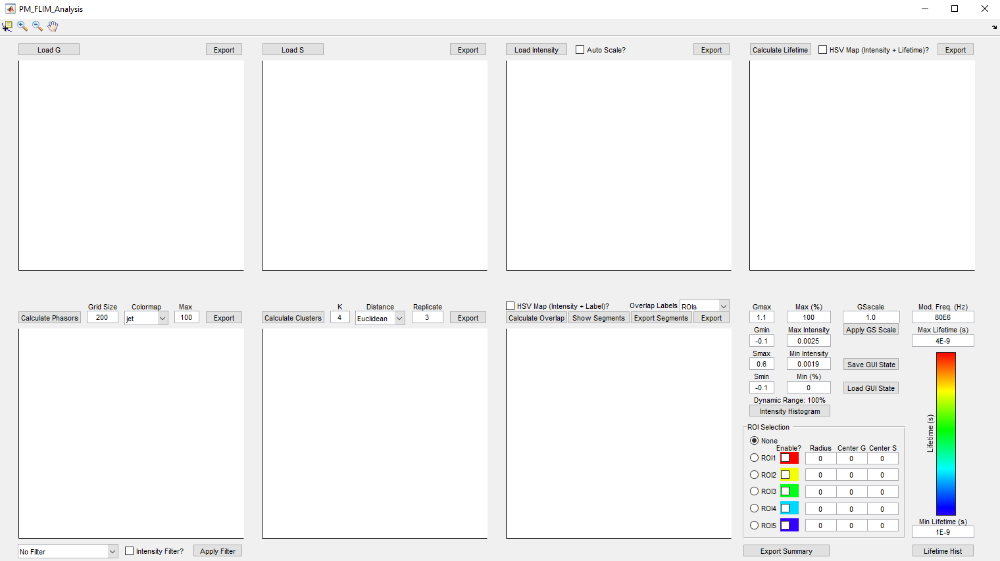

## 3. Data Import

The user only needs to acquire and store the "Intensity", "G", and "S"
images from an instant FLIM imaging experiment, as other FLIM data can
be generated from these three raw images in the Instant-FLIM-Analysis
program.

-   In the "G" image, the value of each pixel is the x-coordinate
    (horizontal coordinate) of the phasor plot for that pixel. The G
    values should be between 0 to 1. Values outside of this range are
    caused by noise.

-   In the "S" image, the value of each pixel is the y-coordinate
    (vertical coordinate) of the phasor plot for that pixel. The S
    values should be between 0 to 0.5. Values outside of this range are
    caused by noise.

-   In the "Intensity" image, the value of each pixel is the two-photon
    fluorescence intensity reading, i.e., the voltage output of the
    detection PMT.

We have included two sets of instant FLIM data as examples in the GitHub
repository. The 2D images in "/data/BPAE\_cells\_2D" were acquired from
fixed bovine pulmonary artery endothelial (BPAE) cells (FluoCells
prepared slide \#1, F36924); the 3D image stacks in
"/data/zebrafish\_3D" were captured from a living EGFP-labeled
*Tg(sox10:megfp)* zebrafish embryo at two days post fertilization. In
this protocol, we will use the 3D zebrafish data to demonstrate the
functions of the program.

Import the "G" image by clicking the "Load G" button (1) and selecting
the related file (2). Here, we use the
"WL800\_PX250\_5mW\_AVGx3\_d0um\_dz1um\_t0\_G.tif" file in
"/data/zebrafish\_3D".

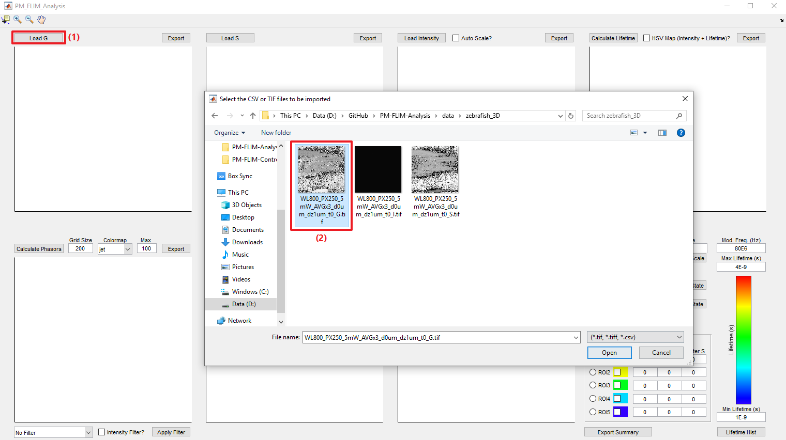

Similarly, import the "S" image,
"WL800\_PX250\_5mW\_AVGx3\_d0um\_dz1um\_t0\_S.tif", and the "Intensity"
one, "WL800\_PX250\_5mW\_AVGx3\_d0um\_dz1um\_t0\_I.tif", using the "Load
S" (1) and "Load Intensity" (2) buttons, respectively.

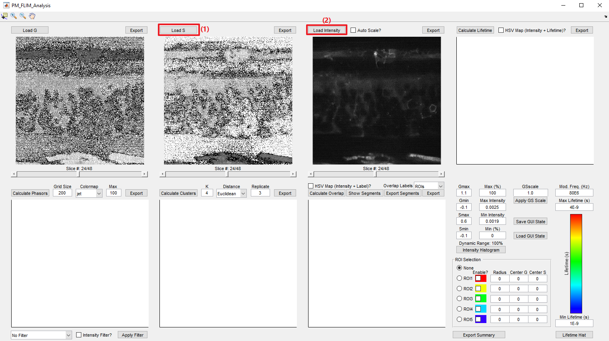

At this moment, all the raw instant FLIM data required by the program
has been imported. The sliders below the images can be used to visualize
different slices in the 3D stack.

## 4. Data Pre-Processing

Some pre-processing steps are needed before analyzing the data. First,
adjust the range of G and S by filling in the values of "Gmax", "Gmin",
"Smax", and "Smin" (1). The default values, "Gmax=1.1", "Gmin=-0.1",
"Smax=0.6", and "Smin=-0.1", are recommended as pixels slightly
perturbed by noise are included in the analysis. Next, adjust the
Intensity range by either specifying the exact or percentage max and min
intensity values (2) or enabling the "Auto Scale?" checkbox (3). The
histogram of the intensity image can be viewed with the "Intensity
Histogram" button (4), where the max and min intensities are marked with
the red and blue lines, respectively:

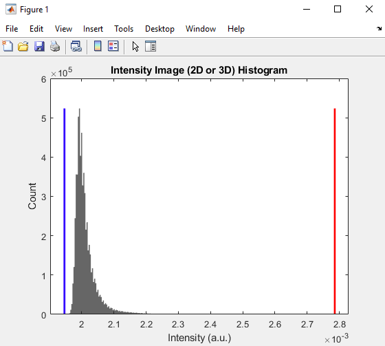

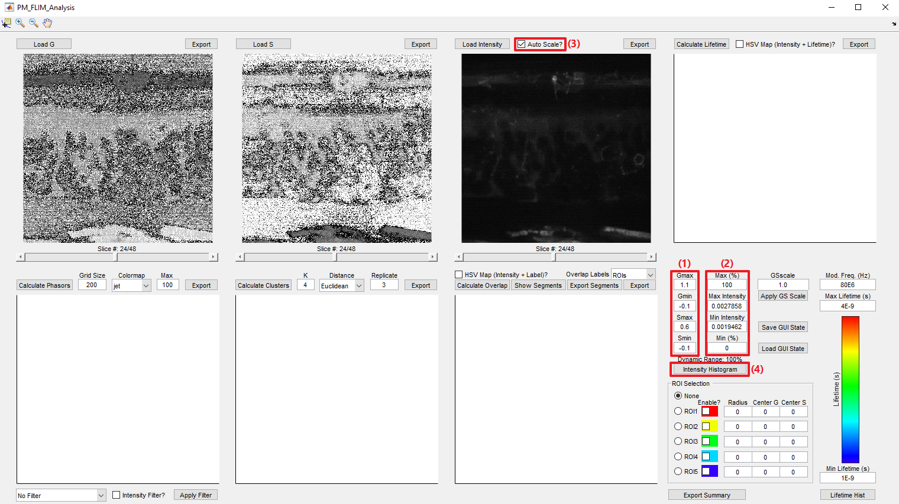

We recommend the user to adjust the max and min intensity values such
that, by saturating a small percentage of pixels with high intensity,
more details in the image can be visualized:

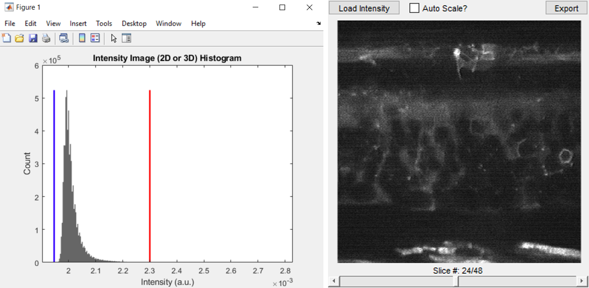

In addition, the signal-to-noise ratio (SNR) of the raw images, and
consequently the SNR of generated images, can be improved by applying
filters to the raw data. To do that, select a filter from the "No
Filter" pop-up menu (1). If the "Intensity Filter?" checkbox (2) is
enabled, the filter is also applied to the Intensity image; otherwise,
only the phasor images (G and S) are filtered. Click the "Apply Filter"
button (3) to perform the filtering operation. We recommend using the
"3x3 Median Filter (3 Times)" or other median filters, as median
filtering does not decrease the image resolution (*1*). The filtering
operation could take some time depending on the size of the raw data. A
progress window showing the filtering progress will appear during the
operation.

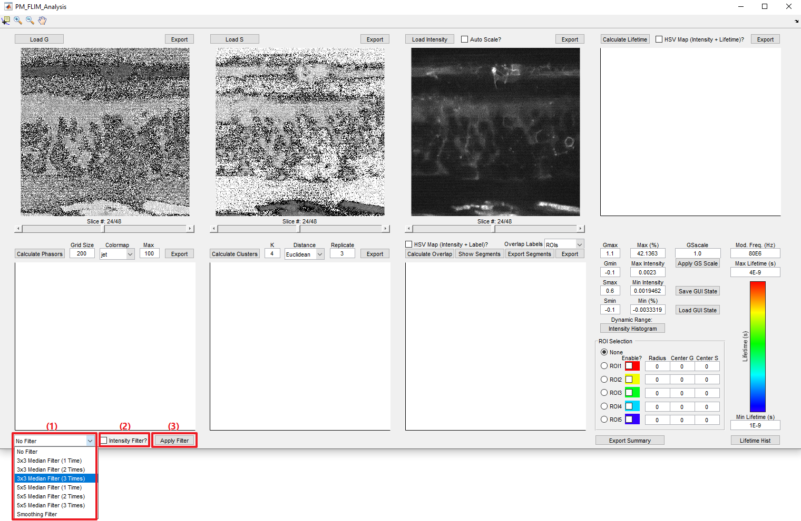

After filtering, the raw images look less noisy than before:

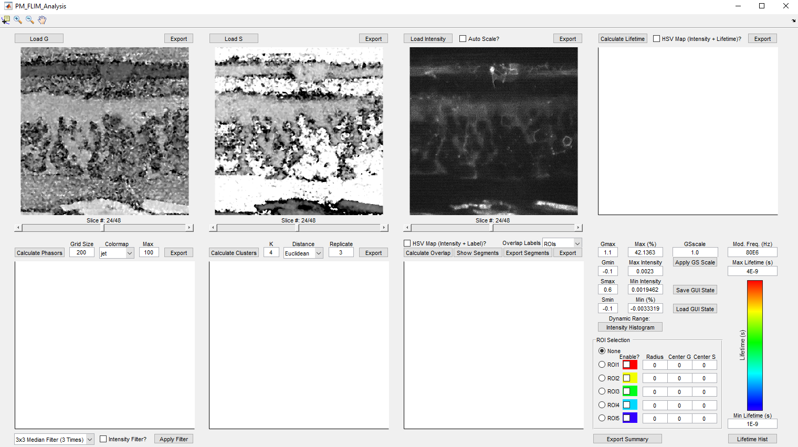

## 5. Fluorescence Lifetime Images

Fill in the "Mod. Freq. (Hz)" box (1) with the modulation frequency of
the excitation laser during the instant FLIM image acquisition. We use a
mode-locked Ti:sapphire laser (Spectra Physics Mai Tai BB, 710-990 nm,
100 fs, 80 MHz) in our instant FLIM system, so we write "80E6" in this
box. Click the "Calculate Lifetime" button (2) to calculate fluorescence
lifetimes. Note that there are two approaches to calculate fluorescence
lifetimes in frequency-domain FLIM: phase-derived or modulation-derived
approaches (*2*). In this work, we only consider phase-derived lifetimes
for its simpler mathematical form compared to modulation-derived ones.
The "HSV Map (Intensity + Lifetime)?" button (3) determines whether the
lifetime image is displayed in raw or composite mode: if it is disabled,
the raw lifetime image is shown in gray scale; if it is enabled, a
composite lifetime image, where the image's intensity and lifetime
values are mapped to the pixels' brightness and hue, respectively, is
displayed. The range of displayed lifetime values can be adjusted with
the "Max Lifetime (s)" and "Min Lifetime (s)" boxes (4). The histogram
of the lifetime image can be viewed with the "Lifetime Hist" button (5),
where the max and min lifetimes are marked with the red and blue lines,
respectively:

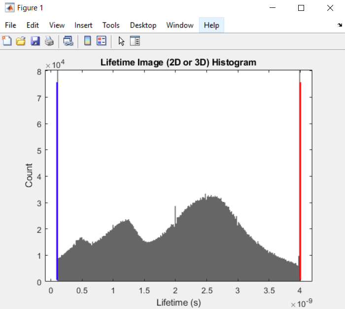

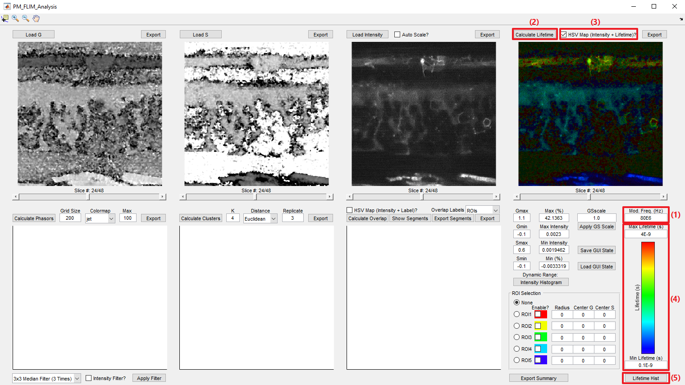

## 6. Phasor Plots

Phasor plots are 2D histograms of the pixels' G and S values. To
generate phasor plots, specify the number of bins, or grids, in the
"Grid Size" box and then click the "Calculate Phasors" button (1). A
window will pop up showing the calculation progress. Once the phasor
plot is generated, the user can change its colormap in the "Colormap"
pop-up menu (2). The max displayed value of the 2D histogram, which is
generated automatically, can also be changed in the "Max" box (3).

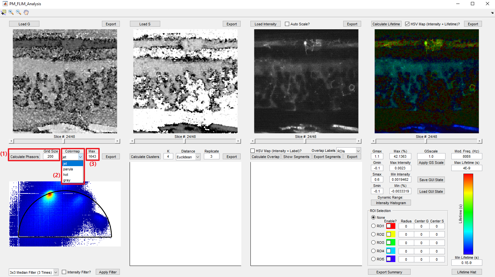

Because most of the pixels in the raw data are background noise, it is
not uncommon to see these noise phasors locating outside of the
semicircle. This issue can be addressed by increasing the value in the
"Min Intensity" box to prevent the background noise pixels (intensity
lower than the "Min Intensity" value) from being considered in
calculating phasors:

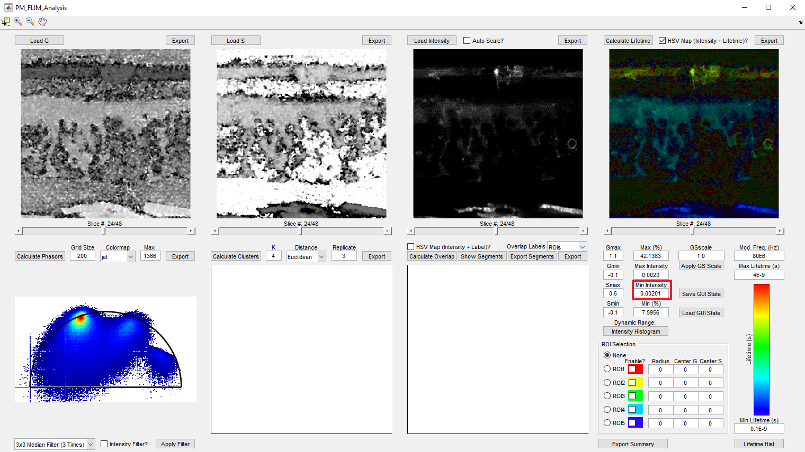

## 7. ROI Labeling of Phasors

The Instant-FLIM-Analysis program allows the user to draw ROIs on the
phasor plot such that the pixels corresponding to the phasors located
inside the ROIs can be identified and labeled with the ROIs' colors. By
properly drawing the ROIs and labeling the pixels, the user can
effectively segment the raw images based on different FLIM signatures of
the image structures. Before drawing ROIs, make the ROI selection with
the radio buttons (1). Draw the ROI on the phasor plot (2) by clicking,
holding, moving, and releasing your mouse. The corresponding pixels in
the raw image will be labeled to the ROI's color whenever the ROI is
drawn or updated. Up to five ROIs can be drawn simultaneously. Once
drawn, the ROIs and the labeled pixels can be enabled or disabled using
the "Enable?" checkboxes (1). The ROIs' radii and center G and S
coordinates are shown in the "Radius", "Center G", and "Center S" boxes
(3) when they are drawn. The user can manually modify these values to
change the sizes and locations of the corresponding ROIs.

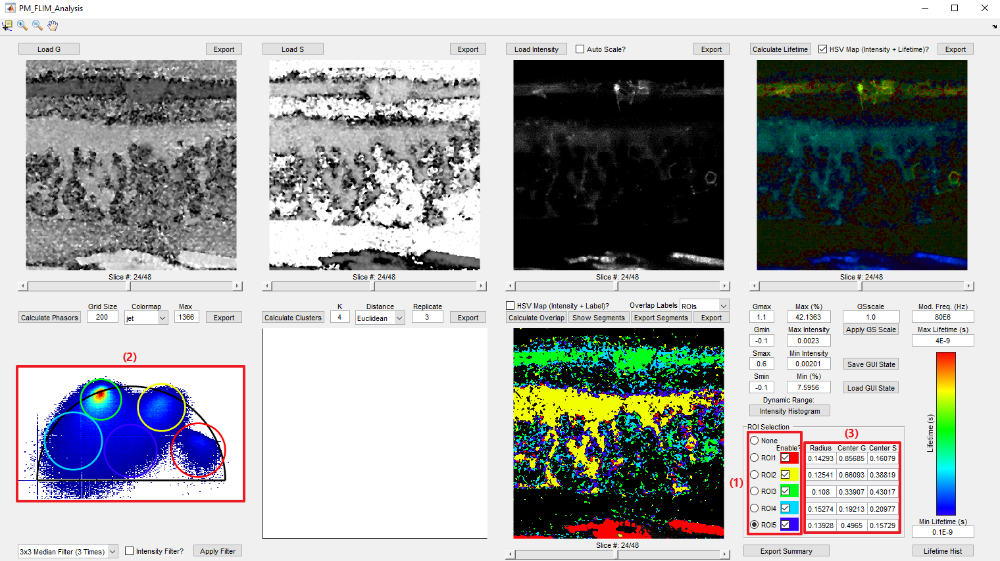

Like the composite lifetime image, the user can enable the "HSV Map
(Intensity + Label)?" checkbox to map the intensity and labeled colors
to the pixels' brightness and hue, respectively:

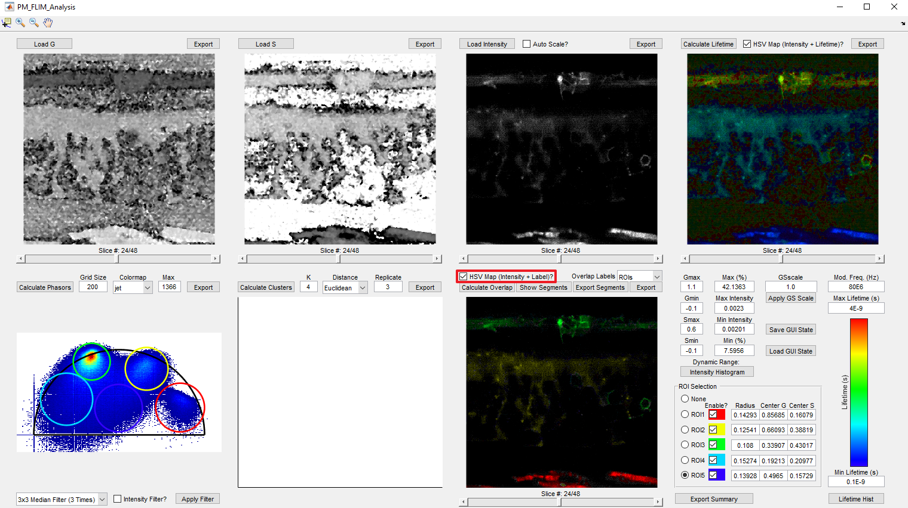

## 8. K-Means Clustering of Phasors

The Instant-FLIM-Analysis program includes an unsupervised machine
learning feature, i.e., K-means clustering (*3*, *4*), which can be used
to automate the manual ROI-based phasor labeling approach above in an
unbiased way. Before performing K-means, specify the number of clusters
(K), the distance metric (squared Euclidean, L1, or cosine), and the
number of times to replicate the procedure (1). Start the procedure by
clicking the "Calculate Clusters" button (2). The K-means clustering
algorithm can be time-consuming for large images (3D or 4D). A window
will pop-up showing the progress of the operation:

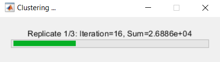

When the K-means clustering is complete, switch the "Overlap Labels"
pop-up menu (3) to "Clusters", and click the "Calculate Overlap" button
(4). In the overlap image below, the pixels corresponding to different
clusters will be labeled with the clusters' colors.

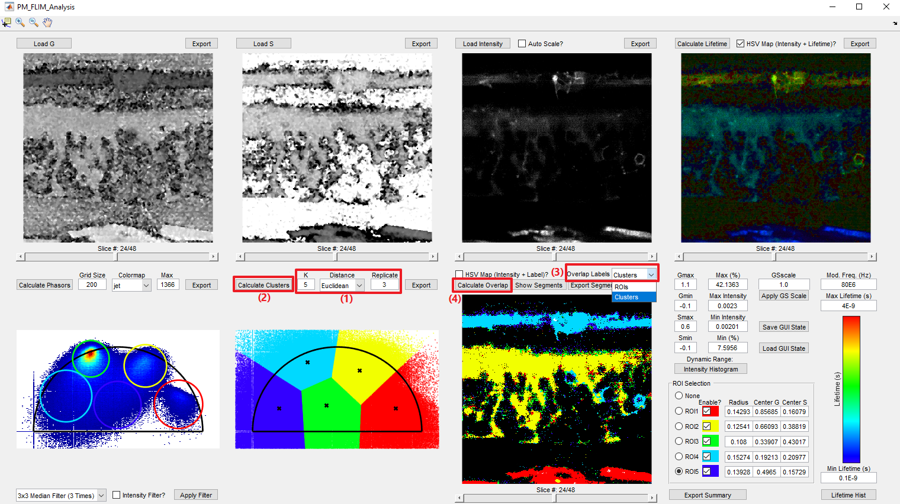

Likewise, the user can enable the "HSV Map (Intensity + Label)?"
checkbox to map the intensity and cluster colors to the pixels'
brightness and hue, respectively:

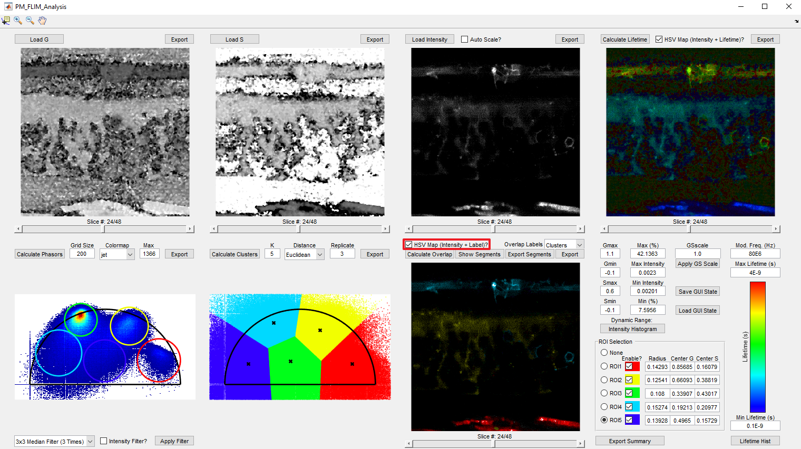

## 9. Image Segmentation

Both the ROI labeling and K-means clustering operations can be used to
segment the images. For the ROI labeling and K-means clustering results,
the pixels corresponding to each ROI and each cluster are grouped into a
single segment, respectively. Before performing image segmentation,
select whether the ROIs or clusters results are used in the "Overlap
Labels" pop-up menu (1). The "Show Segments" button (2) can be used to
display the segmented images as separate figures. Note that only a
single frame of the stack (3D or 4D) can be displayed in this way:

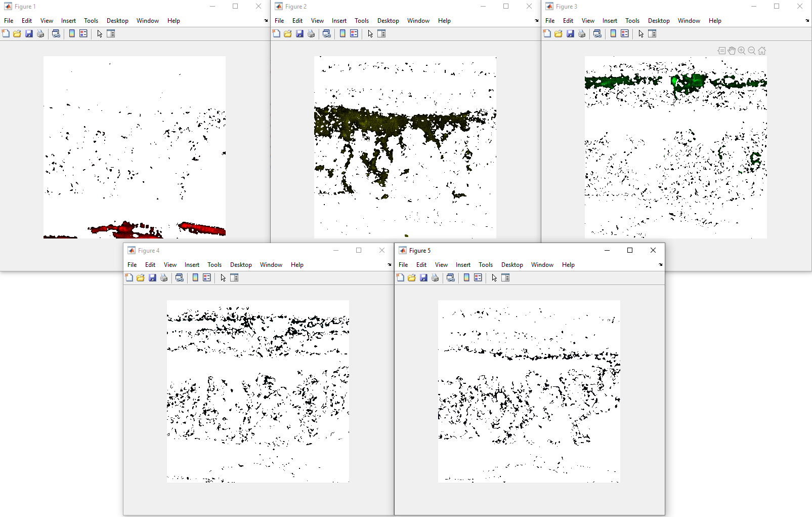

The "Export Segments" button (3) can be used to export the segments into
separate TIF images. In this way, the exported segmented images have the
same size as the raw image (3D or 4D).

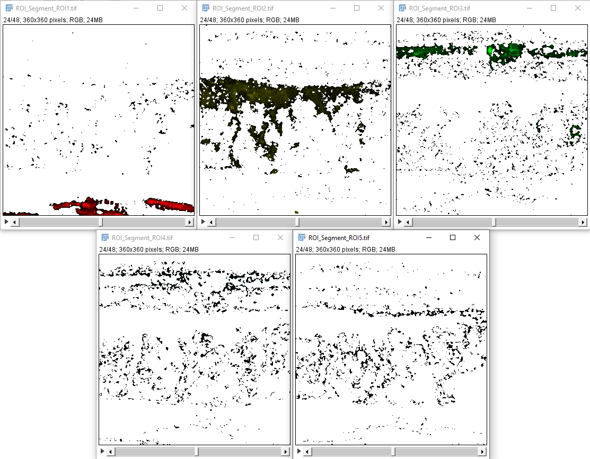

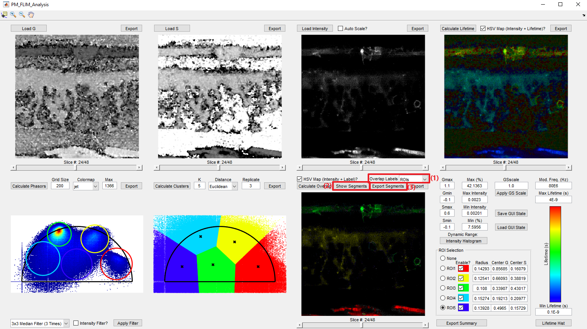

## 10. Data Export

All images and plots that can be seen in the Instant-FLIM-Analysis
program can be exported into TIF files by using the "Export" buttons
next to the images/plots. In addition, the screenshot of the program's
whole GUI can be exported using the "Export Summary" button.

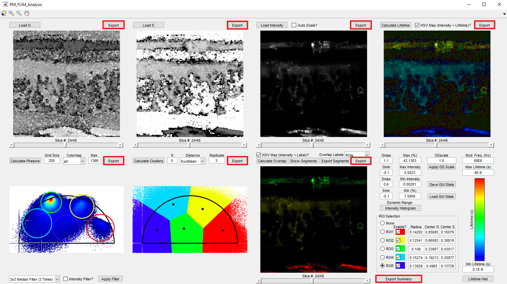

The user needs to specify the file names in order to export the images.
All files should be saved to the default directory, where the program
itself locates.

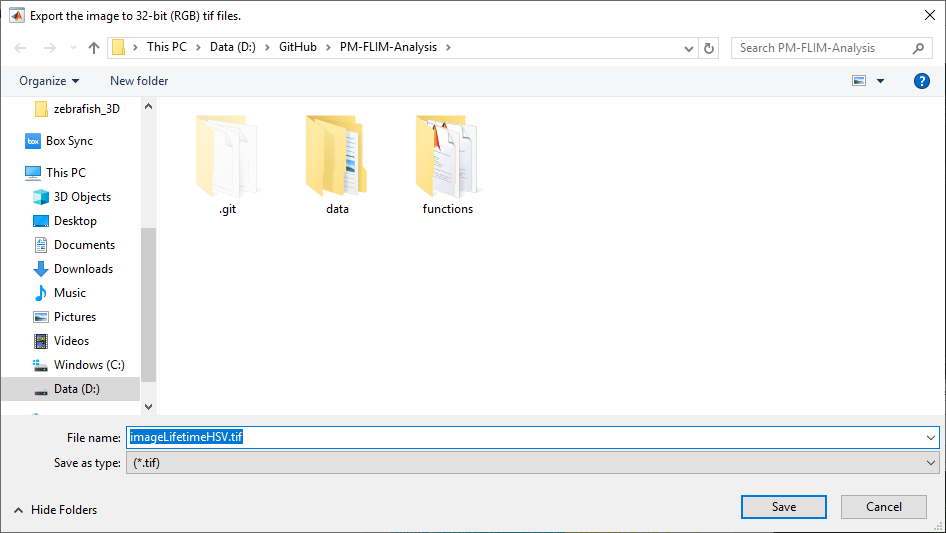

All exported TIF images are 32-bit. If the images are gray scale, the
value of each pixel is a single-precision (32-bit) real number; if the
images or plots have colors, the exported files are RGB format where
each channel is 8-bit.

We recommend the user to view the 32-bit TIF images in ImageJ
(<https://fiji.sc/>). For the single-precision images, such as the gray
scale lifetime image, the lifetime value of each pixel can be directly
viewed. For the images with colors, the information of the exact
lifetime values is lost; one can refer to the lifetime colormap in the
program to get this information. Also, the Instant-FLIM-Analysis program
will only export images to 3D stacks, even if the raw data are 4D;
therefore, the user needs to manually change the exported 3D stacks to
4D by using the "Stack to Hyperstack" function in ImageJ.

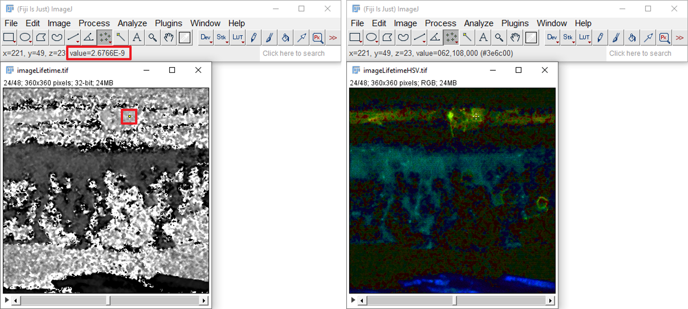

## 11. Save/Load Program States

The program allows the user to save the GUIs' current states, including
the values of all edit boxes, pop-up menus, radio buttons, checkboxes,
and most importantly, the radii and locations of the ROIs. To save the
program states, click the "Save GUI State" button (1). A window will pop
up asking the user to specify the file name. The file should be saved to
the default directory, where the program itself locates.

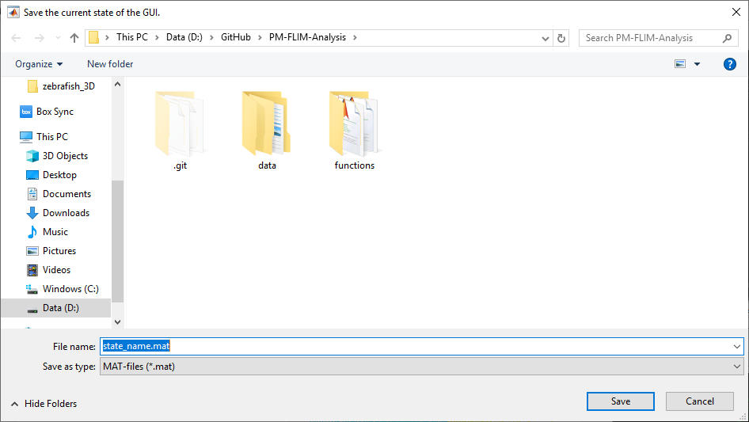

To recover the GUIs' state from a saved file, click the "Load GUI State"
button (2) and select the state file (.mat) you just saved.

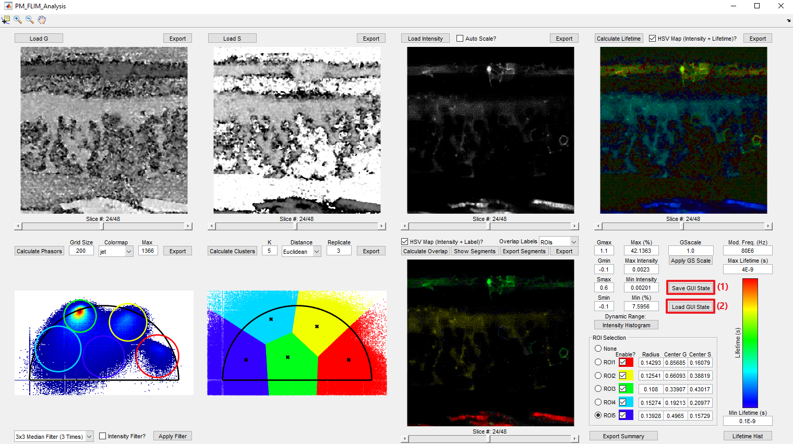

As an example, we modify the ROIs as follows:

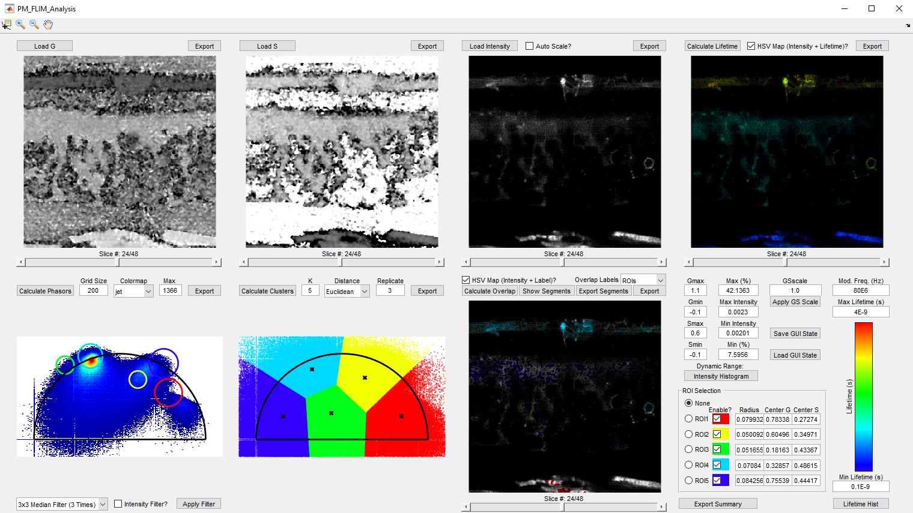

By loading the GUI state file, the ROIs, as well as other GUI elements,
can be recovered to the previous states:

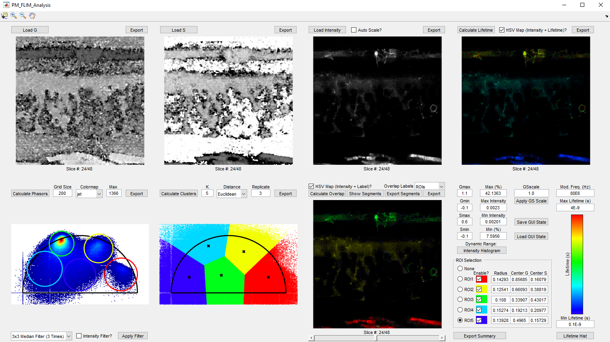

## 12. Add New Functions

The Instant-FLIM-Analysis program is fully open-source and highly
modularized into subfunctions. Users with Matlab programming expertise
can easily modify the code to customize existing functions or to add new
functions in the "functions" folder:

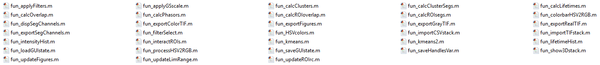

The GUI can also be changed using Matlab's "guide" command:

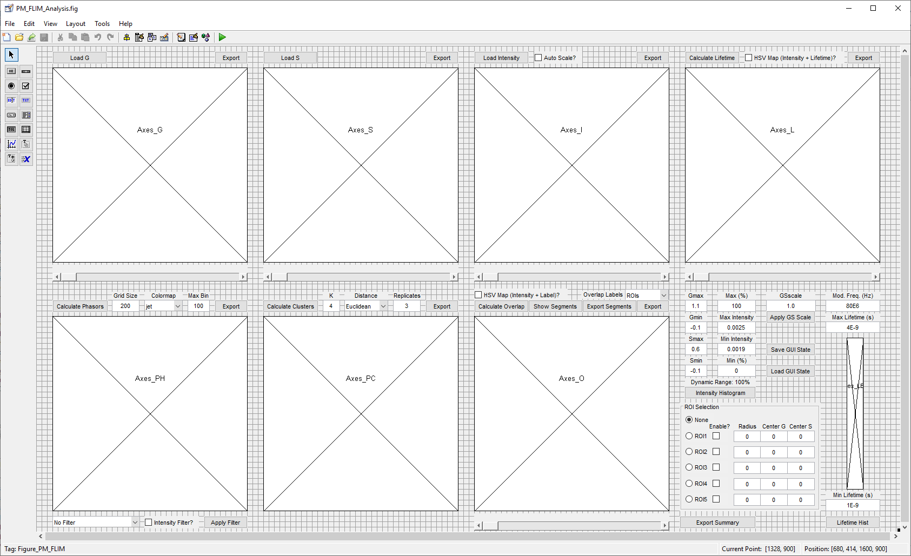

## References

1. S. Ranjit, L. Malacrida, D. M. Jameson, E. Gratton, Fit-free analysis of fluorescence lifetime imaging data using the phasor approach. *Nat.
Protoc.* **13**, 1979--2004 (2018).

2. M. Y. Berezin, S. Achilefu, Fluorescence Lifetime Measurements and Biological Imaging. *Chem. Rev.* **110**, 2641--2684 (2010).

3. A. K. Jain, Data clustering: 50 years beyond K-means. *Pattern Recognit. Lett.* **31**, 651--666 (2010).

4. Y. Zhang, T. Hato, P. C. Dagher, E. L. Nichols, C. J. Smith, K. W. Dunn, S. S. Howard, Automatic segmentation of intravital fluorescence microscopy
images by K-means clustering of FLIM phasors. *Opt. Lett.* **44**, 3928--3931 (2019).


## License & Copyright
© 2019 Yide Zhang, University of Notre Dame

Licensed under the [Apache License 2.0](LICENSE)
